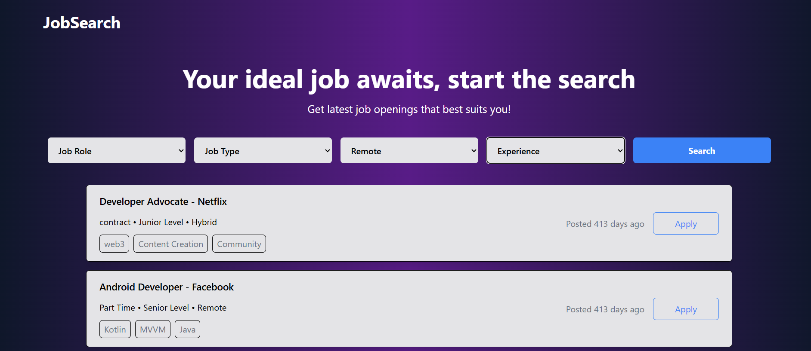
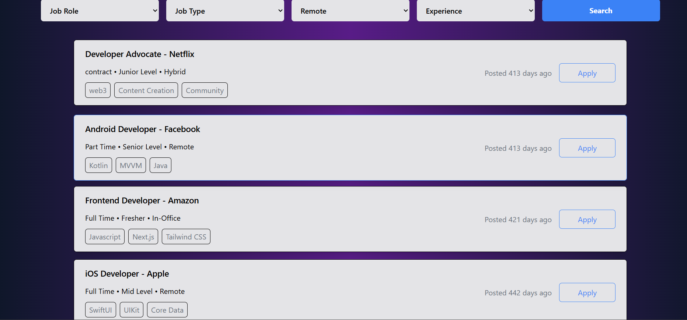
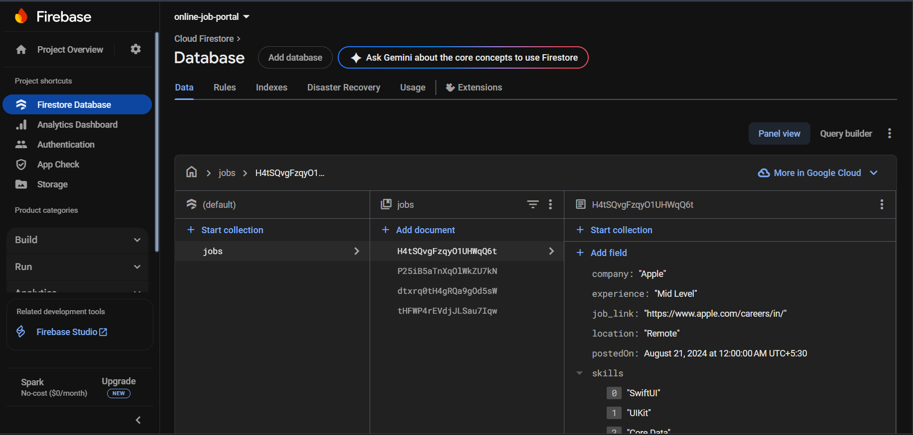

# Job Portal

A full-stack application for managing job listings, applications, recruiters and job seekers — built to simplify the hiring workflow and provide a clean, user-friendly experience.
## User Interface


## Job Listing


## Database

---

## 🚀 Features

- Separate roles: **Recruiter** (post jobs, manage applications) & **Job Seeker** (browse jobs, apply, manage profile)  
- User authentication & role-based access  
- Job posting, editing and deletion by recruiters  
- Searching, filtering and applying for jobs by job seekers  
- Application management: recruiters can shortlist, reject or accept applicants  
- Profile management (upload resumes, update details)  
- Responsive UI for modern devices  

---


## 🛠️ Getting Started

### Prerequisites

- Node.js (v14 or newer recommended)  
- npm or yarn  
- Supabase database 

### Installation

```bash
# Clone the repo
git clone https://github.com/yogesh032003/Job-Portal.git
cd Job-Portal

# Install dependencies 
npm install
npm run dev
